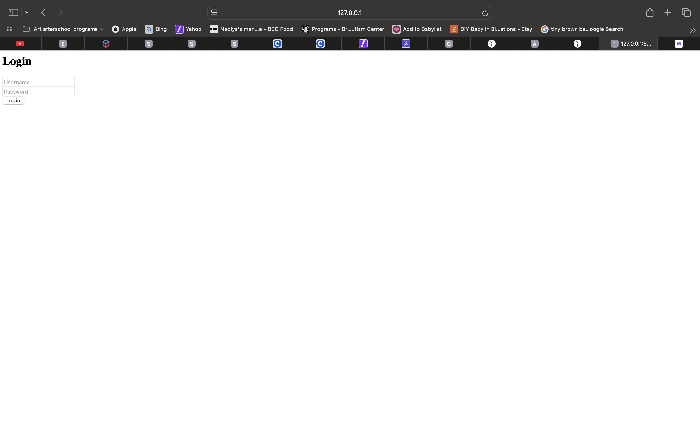
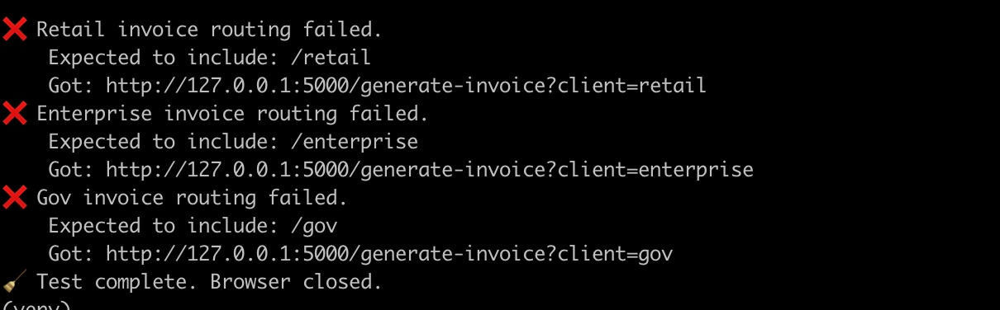

# UAT Billing Test Automation Suite


This project simulates a **User Acceptance Testing (UAT) automation suite** for a billing web application.

The test framework validates routing logic for different client types (`retail`, `enterprise`, `gov`) and includes a login simulation using **Python, Selenium, and pytest**.

The goal of this project is to demonstrate how a QA engineer can build structured automated tests to validate system behavior, detect defects, and verify expected billing workflows.

---

## Preview

  


## Automated Test Results


---

## Testing Scope

This test suite validates:

- Login workflow
- Invoice routing logic for **retail clients**
- Invoice routing logic for **enterprise clients**
- Invoice routing logic for **government clients**
- Correct routing behavior for different account types

---

## Project Structure

```
uat-billing-tests/
│
├── automation/      # Python Selenium automation scripts
├── mock-app/        # Flask app simulating a billing system
├── test-cases/      # Manual test case documentation
├── results/         # Output logs and screenshots from test runs
├── tests/           # pytest automated tests
├── requirements.txt
└── README.md
```
---

## Tech Stack

- Python
- Selenium WebDriver
- pytest
- Flask
- ChromeDriver
- Git

---

## How to Run Locally

### 1. Clone the repository

```bash
git clone https://github.com/charellpeterkin1/uat-billing-tests.git
cd uat-billing-tests
```

### 2. Create and activate a virtual environment

```bash
python3 -m venv venv
source venv/bin/activate
```

### 3. Install dependencies

```bash
pip install -r requirements.txt
```

### 4. Start the mock billing application

```bash
cd mock-app
flask run
```

### 5. Run the automation tests

```bash
cd automation
source ../venv/bin/activate
python3 test_invoice_routing.py
```

## Sample Test Output

```
Login form filled successfully
Retail invoice routing passed
Enterprise invoice routing passed
Gov invoice routing passed
Test complete. Browser closed.
```
## Why This Project Matters

This project demonstrates:

- QA automation using Python and Selenium
- Automated validation of billing workflows
- Structured test case design
- Reproducible automated tests using pytest
- End-to-end testing with a simulated application

## Author

Charell Peterkin

QA Automation | Software Testing | Python

GitHub: https://github.com/charellpeterkin1

LinkedIn: https://www.linkedin.com/in/charellpeterkin

